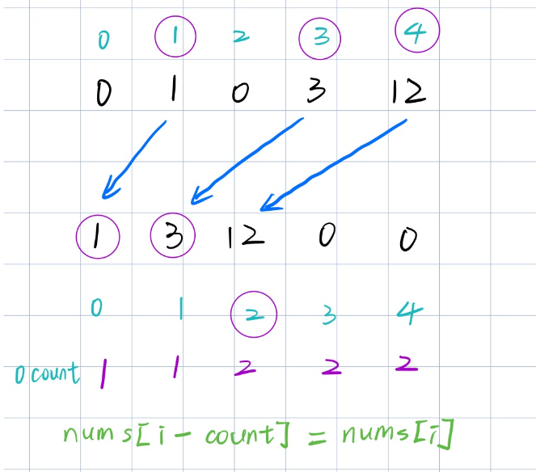

# 算法

## LeetCode hot 100篇

### 1. 两数之和

原题链接：

[1. 两数之和 - 力扣（LeetCode）](https://leetcode.cn/problems/two-sum/description/?envType=study-plan-v2&envId=top-100-liked)

```c++
class Solution {
public:
    vector<int> twoSum(vector<int>& nums, int target) {
        int n = nums.size();
        unordered_map<int, int>mp;		//使用哈希表记录<number, index>
        vector<int> res(2, 0);
        for(int i = 0; i < n; i ++)
        {
            if(mp.find(target - nums[i]) != mp.end())
            {
                res[0] = i;
                res[1] = mp[target - nums[i]];	//如果 target - nums[i]存在在哈希表中则找到了
                return res;
            }
            mp[nums[i]] = i;
        }
        return res;
    }
};
```

### 2. 字母异位词

原题链接：

[49. 字母异位词分组 - 力扣（LeetCode）](https://leetcode.cn/problems/group-anagrams/description/?envType=study-plan-v2&envId=top-100-liked)

```c++
class Solution {
public:
    vector<vector<string>> groupAnagrams(vector<string>& strs) {
        int n = strs.size();
        unordered_map<string, vector<string>> mp;
        for(int i = 0; i < n; i ++)
        {
            string tmp = strs[i];			//拷贝初始化，调用了拷贝构造函数
            sort(tmp.begin(), tmp.end());	//如果是字母异位词，则排序后的词组是相同的，可作为索引
            mp[tmp].push_back(strs[i]);
        }
        vector<vector<string>> res;
        for(auto& it : mp)
        {
            res.push_back(it.second);		//遍历mp的迭代器，it.first为key，it.second为value
        }
        return res;
    }
};
```

### 3. 最长连续序列

原题链接：

[128. 最长连续序列 - 力扣（LeetCode）](https://leetcode.cn/problems/longest-consecutive-sequence/description/?envType=study-plan-v2&envId=top-100-liked)

```c++
class Solution {
public:
    int longestConsecutive(vector<int>& nums) {
        int n = nums.size();
        int ans = 0;
        unordered_set<int> st(nums.begin(), nums.end());
        for(auto& x : st)
        {
            if(st.contains(x - 1))
                continue;
            int y = x + 1;
            while(st.contains(y))
                y ++;
            ans = max(ans, y - x);
        }
        return ans;
    }
};
```

> 思路：
>
> 1. 因为时间复杂度要求为o(n)则不允许排序
> 2. 需要求出最长连续序列且不要求在原数组中连续，则可以使用unordered_set，即保证这个数存在即可
> 3. 遍历set，设遍历的数为 x  则以 ==x为原点，寻找x下一个数是否存在，设y = x + 1，若 y 存在，则再以y为原点进行寻找==

### 4. 移动零

原题链接：

[283. 移动零 - 力扣（LeetCode）](https://leetcode.cn/problems/move-zeroes/?envType=study-plan-v2&envId=top-100-liked)

```c++
class Solution {
public:
    void moveZeroes(vector<int>& nums) {
        int n = nums.size();
        int count = 0;
        for(int i = 0; i < n; i ++)
        {
            if(nums[i] != 0)
                nums[i - count] = nums[i];
            else
                count ++;
        }
        for(int i = n - count; i < n; i ++)
            nums[i] = 0;
    }
};
```

> 思路：
>
> 1. 对于 nums[i] == 0 ：统计0的个数
> 2. 对于 nums[i] != 0：移动数的位置到它应该放置的地方



### 5. 盛水最多的容器

原题链接：

[11. 盛最多水的容器 - 力扣（LeetCode）](https://leetcode.cn/problems/container-with-most-water/?envType=study-plan-v2&envId=top-100-liked)

```c++
class Solution {
public:
    int maxArea(vector<int>& height) {
        int n = height.size();
        int l = 0, r = n - 1;	//相向双指针
        int res = 0;
        while(l < r)
        {
            int h = min(height[l], height[r]); //高度为二者中 小的那一个
            res = max(res, h * (r - l));	   //求最大值
            if(height[l] < height[r])		   //如果左边的比右边的小，移动左边的指针，反之移动右边的	
                l ++;
            else r --;
        }
        return res;
    }
};
```

> 思路：
>
> 之所以选择相向双指针是因为：当(r - l)最大即长方形的长最大时，长方形面积最大值是被包含在相向双指针的区域内

### 6. 三数之和

原题链接：

[15. 三数之和 - 力扣（LeetCode）](https://leetcode.cn/problems/3sum/description/?envType=study-plan-v2&envId=top-100-liked)

```c++
class Solution {
public:
    vector<vector<int>> threeSum(vector<int>& nums) {
        int n = nums.size();
        sort(nums.begin(), nums.end());		//数组排序
        vector<vector<int>> res;			
        for(int i = 0; i < n; i ++)
        {
            if(nums[i] > 0)break;			//如果nunms[i] > 0说明 sum 一定大于 0
            if(i > 0 && nums[i] == nums[i - 1])continue;	//去重
            int j = i + 1, k = n - 1;
            
            while(j < k)
            {
                int sum = nums[i] + nums[j] + nums[k];
                if(sum > 0)
                    k --;
                else if(sum < 0)
                    j ++;
                else
                {
                    res.push_back({nums[i], nums[j], nums[k]});
                    while(j < k && nums[j] == nums[++j]);	//去重
                    while(j < k && nums[k] == nums[--k]);	//去重
                }
            }
        }
        return res;
    }
};
```

### 7. 接雨水

原题链接：

[42. 接雨水 - 力扣（LeetCode）](https://leetcode.cn/problems/trapping-rain-water/description/?envType=study-plan-v2&envId=top-100-liked)

```c++
class Solution {
public:
    int trap(vector<int>& height) {
        int n = height.size();
        stack<int> stk;
        int res = 0;
        for(int i = 0; i < n; i ++)
        {
            while(!stk.empty() && height[i] > height[stk.top()])	//使用了单调递减栈
            {
                int bottom = height[stk.top()];			//因为是单调递减栈，所以栈顶就是bottom
                stk.pop();
                if(!stk.empty())	//如果bottom去掉后栈内还有元素，则一定有雨水
                {
                    res += (min(height[i], height[stk.top()]) - bottom) * (i - stk.top() - 1); //计算有多少雨水
                }
            }
            stk.push(i);
        }
        return res;
    }
};
```

